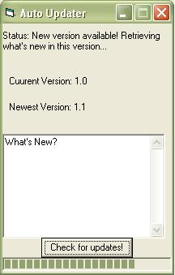



## Auto Update Proram

### Description

Didn't you always wanted to have an auto update form for your program?

Well now you only have to insert frmUpdate to your project, edit to suit your need and you are done!

Please read Readme.txt for instructions!!
 
### More Info
 

             |
---                |---
**Submitted On**   |2004-05-19 15:40:04
**By**             |[Mike Kosmatopoulos](https://github.com/Planet-Source-Code/PSCIndex/blob/master/ByAuthor/mike-kosmatopoulos.md)
**Level**          |Beginner
**User Rating**    |4.8 (67 globes from 14 users)
**Compatibility**  |VB 6\.0
**Category**       |[Miscellaneous](https://github.com/Planet-Source-Code/PSCIndex/blob/master/ByCategory/miscellaneous__1-1.md)
**World**          |[Visual Basic](https://github.com/Planet-Source-Code/PSCIndex/blob/master/ByWorld/visual-basic.md)
**Archive File**   |[Auto\_Updat1747645192004\.zip](https://github.com/Planet-Source-Code/mike-kosmatopoulos-auto-update-proram__1-53891/archive/master.zip)

